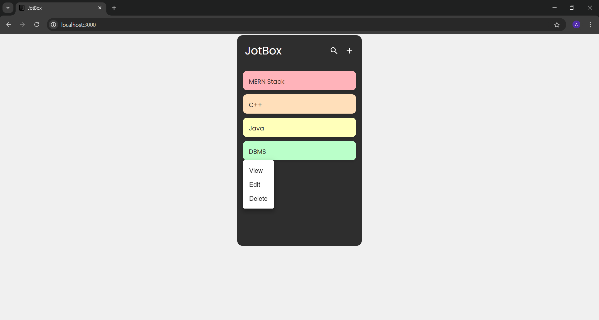

# JotBox

Welcome to JotBox! This is a simple and intuitive notes application built with React. It allows you to manage your notes efficiently with features for adding, displaying, editing, and deleting notes. 


## Features

- **Add Notes** : Easily create new notes.
- **Display Notes** : View all your notes on the Home screen.
- **Edit Notes** : Update your notes as needed.
- **Delete Notes** : Remove notes you no longer need.
- **View Note Content** : Click on a note to view its content directly on the Home screen.
- **Routing** : Navigate through your notes with React Router DOM.
- **Local Storage** : Your notes are saved locally in your browser.


## Snapshot




## Run Locally

Clone the project

```bash
  git clone https://github.com/gupta03akshita/JotBox.git
```

Go to the project directory

```bash
  cd <Project Folder>
```

Install dependencies 

```bash
  npm install
```

Start the application

```bash
  npm start
```

